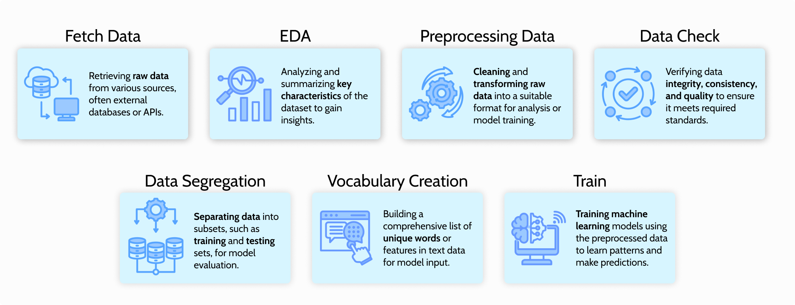

# Unit 2 - Natural Language Processing Pipeline

## 📚 About this Topic 

Natural Language Processing (NLP) is a field of artificial intelligence that focuses on the interaction between computers and human language. Its primary goal is to enable machines to understand, interpret, and generate human-like text. NLP encompasses a range of tasks, including language translation, sentiment analysis, named entity recognition, and text summarization. By leveraging computational linguistics and machine learning, NLP facilitates the extraction of meaningful insights from unstructured textual data.

In the other hand, a data pipeline is a framework for efficiently and systematically moving and processing data from diverse sources to its destination, typically for analysis or storage. It involves a series of automated steps that handle data ingestion, transformation, and loading (ETL). Data pipelines streamline the flow of information, ensuring its integrity and availability for decision-making processes. 

When NLP and data pipelines are integrated, they form a powerful synergy. This combination allows organizations to seamlessly process and analyze vast amounts of textual data. NLP algorithms can be incorporated into the pipeline to extract valuable insights from unstructured text, providing a deeper understanding of language-related patterns. By incorporating NLP into the data pipeline, businesses can efficiently derive actionable intelligence from textual data, enhancing decision-making processes and gaining a competitive edge in the era of big data.

## 🚀 About this Work

This project aims to create a data pipeline for the guided project in the "Natural Language Processing for Deep Learning" course on [Dataquest.io](https://app.dataquest.io/). 
The objective is to use Python, the [Wandb](https://wandb.ai/) platform, and [Apache Airflow](https://airflow.apache.org/) to implement Natural Language Processing (NLP) for identifying tweets related to real disasters. Wandb is a platform for machine learning experiment tracking, collaboration, and visualization, facilitating model performance monitoring and experiment sharing. Apache Airflow is an open-source platform for orchestrating complex workflows, essential for automating tasks in data engineering.

## 🛠️ Data pipeline

The image below illustrates each stage of the data pipeline followed in this project, along with its respective function in the code designed for false tweet detection using NLP.



## ✅ Requirements

To run this project successfully, it's crucial to meet specific requirements and set up a suitable environment. Follow the steps outlined below:

1. **Create a Virtual Environment**
Start by creating a virtual environment to isolate the project dependencies. Use the following commands in your terminal or command prompt:
```
# Create a virtual environment (assuming Python 3)
python3 -m venv myenv # On Windows, python -m venv myenv

# Activate the virtual environment
source myenv/bin/activate  # On Windows, use `myenv\Scripts\activate`

```

2. **Install Required Libraries**
Once the virtual environment is activated, install the necessary libraries listed in the requirements.txt file:
```
pip install -r requirements.txt

```
3. **Setup Apache Airflow**
Check [here](https://airflow.apache.org/docs/apache-airflow/stable/start.html) the official documentation to start apache airflow locally in your computer.

## 🔍 References

[🎥 Video about this project]()
[📚 Ivanovitch's Repository](https://github.com/ivanovitchm/mlops)
