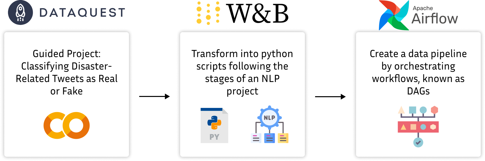
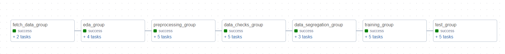

# 🌪️ Natural Language Processing with Disaster Tweets


## 📜 Introduction
This project applies NLP to classify tweets related to natural disasters. The following notebooks guide you through the process of fetching data, exploratory data analysis, preprocessing, data checking, segregation, and training a model.

## 📂 Project Overview
- **Title:** Classifying Disaster-Related Tweets as Real or Fake
- **Objective:** To build an automated pipeline for processing and classifying disaster-related tweets.



- **Details:** This project aims to leverage a solution from the Dataquest.io platform to perform disaster tweet classification using Natural Language Processing (NLP) techniques. The solution is implemented in a Jupyter notebook with a .ipynb extension. The primary objective of this project is to take the developed solution and create a data pipeline using separate .py files, encompassing all the stages of a machine learning project individually and following a streamlined flow. To achieve this, the Wandb platform was employed to manage artifacts and executed files within the data flow. Additionally, Apache Airflow was utilized to orchestrate this pipeline through Directed Acyclic Graphs (DAGs).

## 🛠️ Pipeline Execution
The pipeline is designed to be executed in a sequential manner, with each script in the `src/` directory corresponding to a step in the data processing and model training pipeline:



1. **Data Fetching:** Retrieve real-time tweet data.
2. **Exploratory Data Analysis (EDA):** Analyze the data to uncover patterns and insights.
3. **Preprocessing:** Clean the data to prepare it for modeling.
4. **Data Check:** Ensure the integrity and quality of the preprocessed data.
5. **Data Segregation:** Split the data into appropriate datasets for the training process.
6. **Model Training:** Train a machine learning model to classify the tweets accurately.
7. **Model Testing:** Evaluate the model's performance on new data to assess its generalization and ensure effective learning.

## 🔧 Requirements/Technologies
- **Python Version**: 3.9 or higher. The pipeline is developed and tested with Python 3.9+, ensuring compatibility with the latest language features and libraries.
- **Python Packages**: A comprehensive list of Python packages required for running the pipeline is detailed within the `requirements.txt` file.

## 🚀 Getting Started
To run the pipeline, make sure Apache Airflow is set up and operational. Define the necessary environment variables in the `.env` file, install dependencies from requirements.txt, and follow these steps:

1. Ensure you have Python version 3.9+ and Airflow 2.3+ installed. You can find instructions on how to install Airflow [here](https://airflow.apache.org/docs/apache-airflow/stable/start.html). Remember to configure the path to the `AIRFLOW_HOME` environment variable and the `airflow.cfg` file as instructed in the documentation to define the Airflow home directory and path to the dags folder.

2. Clone the repository: 
   ```
   git clone https://github.com/marianabritoazevedo/mlops2023.git
   ```

3. Navigate to the `Disaster_Tweet_Classification` directory.

4. Install the required libraries: 
   ```
   pip install -r requirements.txt
   ``` 

5. Sign up for a Weights & Biases account to obtain your API key for experiment tracking. Visit the [Weights & Biases sign-up page](https://wandb.ai/signup) to create an account. Once you have your account, locate your API key in the account settings.

   To configure the API key on your machine, add it to the `.env` file in your project's root directory:
   ```
   WANDB_API_KEY='your_api_key_here'
   ```
   Make sure to replace `your_api_key_here` with your actual API key. This `.env` file should not be committed to your version control system; ensure it's listed in your `.gitignore` file to prevent potential security issues.

## 🎥 Video Explanation
Explore the project's methodologies and insights in our detailed [video walkthrough](https://www.youtube.com/watch?v=example-link).

## 👥 Team

- [**Mariana Brito Azevedo**](https://github.com/marianabritoazevedo)
- [**Thaís Medeiros**](https://github.com/thaisaraujom)

## 📚 References
- [Classifying Disaster-Related Tweets as Real or Fake (Dataquest Project)](https://github.com/dataquestio/solutions/blob/master/Mission797Solutions.ipynb)
- [Ivanovitch's repository](https://github.com/ivanovitchm/mlops)