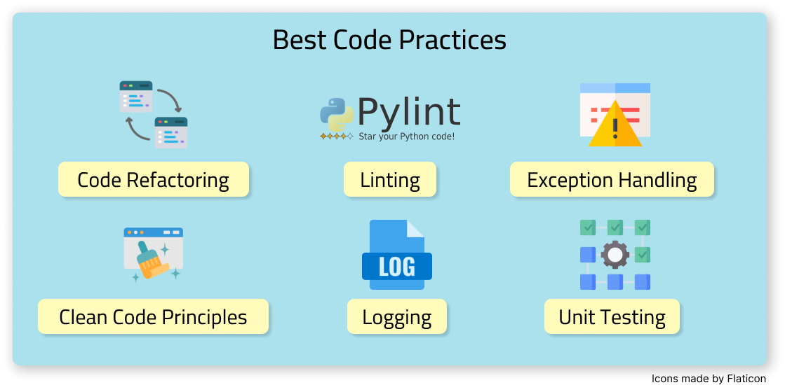

# Unit 1 - Python Essentials for MLOps

## 📚 About this Topic 

This topic aims to compose the grade for the first unit of the Machine Learning-Based Systems Projects course (DCA0305) at the Federal University of Rio Grande do Norte. For this assessment, the goal is to explore essential Python practices in the context of MLOps, including best programming practices. All the topics depicted in the figure below will be explored here! 🚀

As such, three projects were explored, found on the [dataquest.io](https://app.dataquest.io/) platform, with the objective of studying and applying best programming practices in each of them.

### Project 1 - Movie Recommendation System in Python 🎥

**Description:** This project aims to explore the best code practices for MLOps in building a movie recommendation system based on film titles and ratings.

### Project 2 - Airflow Data Pipeline to Download Podcasts 🎧

**Description:** Add description

### Project 3 - Predicting Heart Disease ❤️

**Description:** This project aims to apply the best programming practices in building a KNN classifier for predicting heart diseases.

## ✅ Requirements and technologies

To run any of the three projects mentioned above, you can create a virtual environment and then install the required libraries from the `requirements.txt` file. For detailed instructions, navigate to the respective folders: `project01`, `project02`, or `project03`, to learn how to set up your environment.

The primary technologies employed in this project, utilizing the Python programming language, included `pylint` for code analysis following best practices, `pytest` for creating unit tests, and many other libraries such as `matplotlib` and `scikit-learn` for executing existing code.

## 🔍 References

[🎥 Video about this project](https://www.youtube.com/)

[📜 Dataquest certificate - Intermediate Python for Web Development](https://app.dataquest.io/view_cert/8LNPW67UKIWDK5BB42O5)