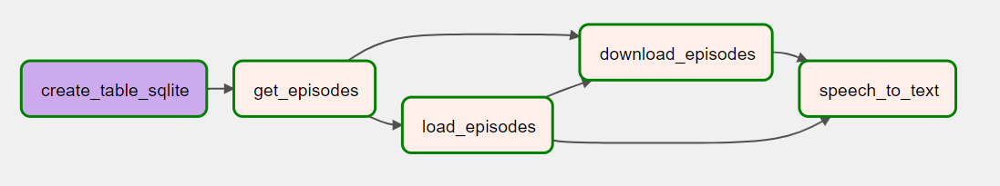

# Project 2 - Airflow Data Pipeline to Download Podcasts 🎧

## ℹ️ About this Project

The Project 02 involves building a data pipeline using the Apache Airflow tool for downloading podcasts. This portfolio project is available on the [Dataquest.io](https://app.dataquest.io/) platform. It is designed to teach how to create a data pipeline using Airflow, construct a DAG (Directed Acyclic Graph), and define tasks to perform various activities within this pipeline. By the completion of this project, you will be able to visualize the following pipeline in Apache Airflow:



## 🚀 How to Run this Project

There are many steps to install the required libraries and run Apache Airflow. To make it easy, it's recommended that you do the following tutorial in at Linux Operating System.

### 1️⃣ Running Apache Airflow

1. **Installing the libraries**

First, install the `sqlite3` library to use as the database for this project:

```
sudo apt install sqlite3
```

Afterward, create a virtual environment using the `requirements.txt` file in this directory. Activate the virtual environment and install the necessary libraries:

```
virtualenv my_env

source my_env/bin/activate

pip install -r requirements.txt
```

2. **Installing Airflow**

First, define the airflow home path:

```
export AIRFLOW_HOME=~/airflow
```

Specify the versions of Airflow and Python. In this tutorial, version `2.3.1` of Airflow is used:

```
AIRFLOW_VERSION=2.3.1
PYTHON_VERSION="$(python --version | cut -d " " -f 2 | cut -d "." -f 1-2)"
```

Create the URL for installation, considering the specified Airflow and Python versions:


```
CONSTRAINT_URL="https://raw.githubusercontent.com/apache/airflow/constraints-${AIRFLOW_VERSION}/constraints-${PYTHON_VERSION}.txt"
```

Finally, install Apache Airflow:

```
pip install "apache-airflow==${AIRFLOW_VERSION}" --constraint "${CONSTRAINT_URL}"
```

3. **Running Airflow**

After installing all the required libraries, run a standalone version of Apache Airflow with the following command:

```
airflow standalone
```

Your terminal will display a detailed log, including your credentials (usually with the username `admin`) to access Airflow. Note down these credentials, access the URL `localhost:8080`, and log in. You should be able to view the Apache Airflow dashboard after successful login. 

### 2️⃣ Necessary configurations in the project

After setting up your project, it's essential to configure Apache Airflow and establish a proper connection to the database.

1. **Specify the DAGs Folder**

The `dags` folder contains the file necessary for this project to run on Airflow. First, identify the path of your DAG file using the `pwd` command. Next, access the configuration file:

```
nano ~/airflow/airflow.cfg
```

In the configuration file, update the dags_folder variable with the path obtained from the pwd command.

2. **Create the database**

Within the dags folder, create a database named episodes.db:

```
sqlite3 episodes.db
```

Verify if the database has been created successfully:

```
.databases
```

Establish a connection between this database and Airflow. Replace `path_to_dags_folder with` the previously obtained path:

```
airflow connections add 'podcasts' --conn-type 'sqlite' --conn-host '<path_to_dags_folder>/episodes.db'
```

Ensure that the connection has been established correctly:

```
airflow connections get podcasts
```

3. **Load data into SQLite**

To load your data, you need to install the following library:

```
pip install apache-airflow[pandas]
```

Once the project is executed, you can enter the database and verify if the data has been loaded:

```
sqlite3 episodes.db
select * from episodes;
```

### 3️⃣ Running the project

After completing all the installations and configurations, you are ready to run the project. Access Airflow using the command `airflow standalone` and select the flow named `podcast_summary`. On the right side, you will find a play button. Click on it and select the option `Trigger DAG`. This will execute your project and display the data pipeline on the screen!

Additionally, you can choose one of the nodes in the graph, and select the option log to view its logs.