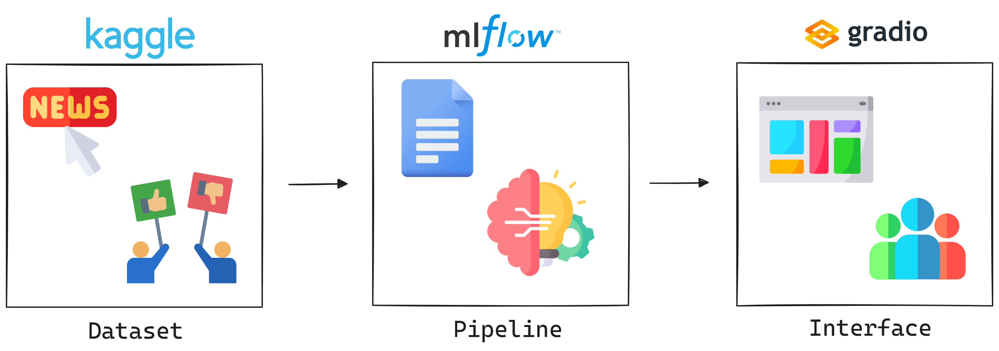
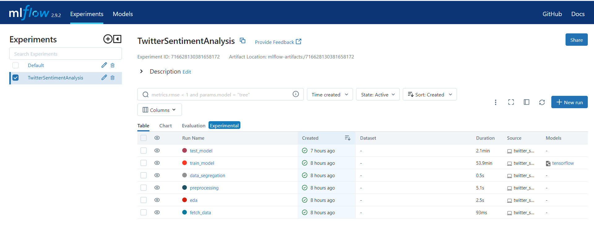
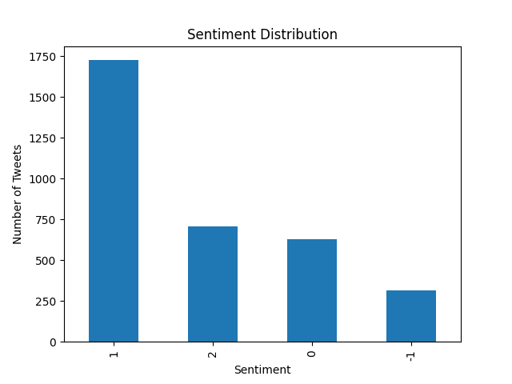
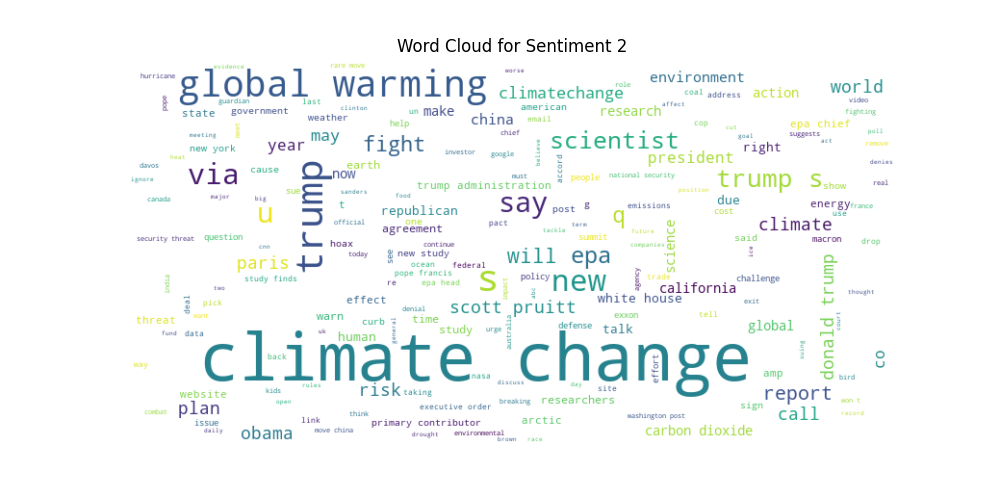
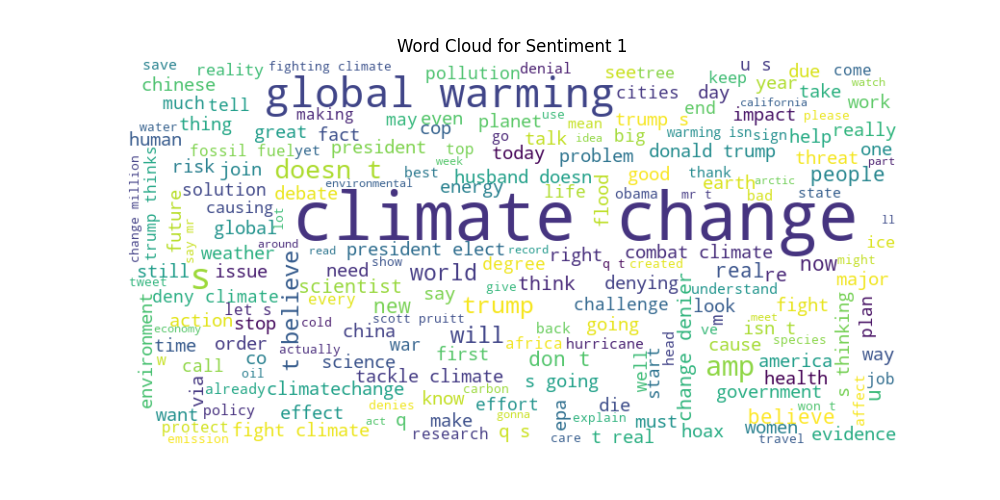
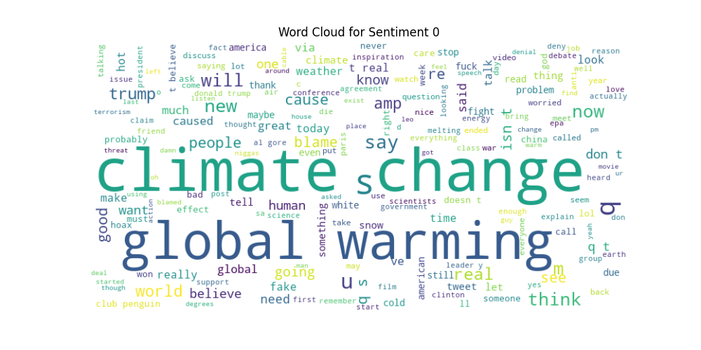
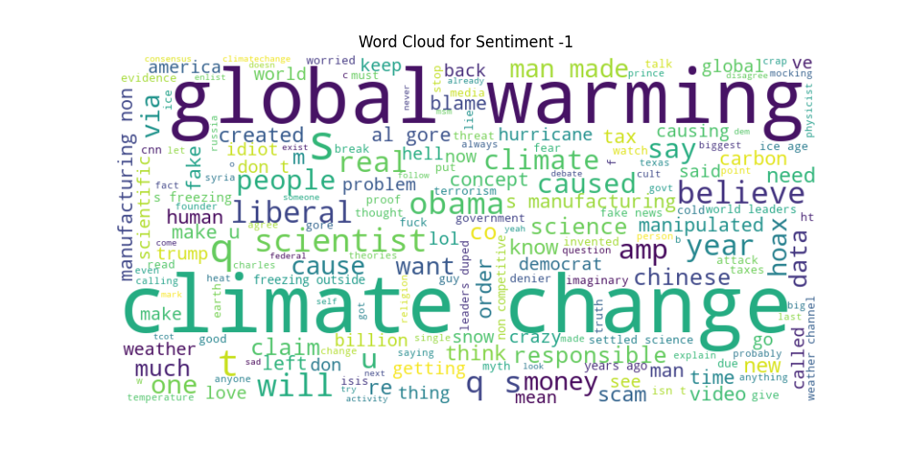
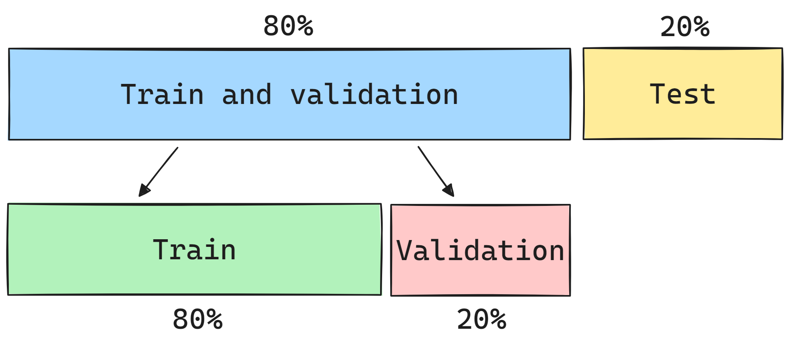
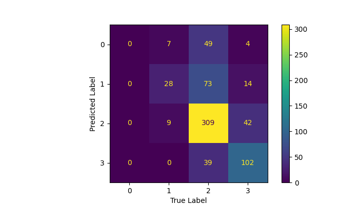
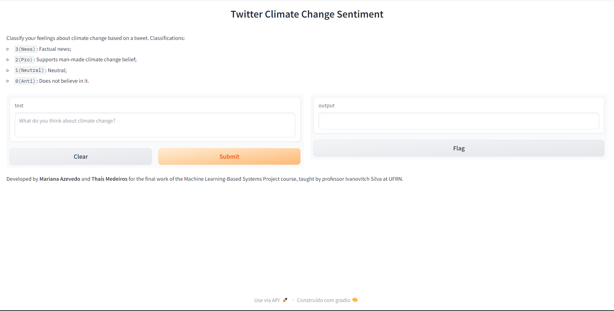

# ☀️ Evaluating Climate Perspectives


## 📜 Introduction
This project employs Natural Language Processing (NLP) to classify tweets related to climate change, distinguishing between factual news and opinions of internet users regarding the belief in the human origin of climate change. To achieve this, an NLP pipeline was created, involving stages such as fetching data, exploratory data analysis, preprocessing, data checking, segregation, training various models, and testing to evaluate the performance of these models. Additionally, a graphical interface was developed to allow interaction with the model.

## 📂 Project Overview

The goal of this project is to create a solution for a multi-class classification problem using NLP and MLOps tools. To achieve this, a dataset from [Kaggle](https://www.kaggle.com/datasets/edqian/twitter-climate-change-sentiment-dataset) related to climate change tweets was utilized, where each tweet can be classified as follows:

- `2(News):` the tweet links to factual news about climate change
- `1(Pro):` the tweet supports the belief of man-made climate change
- `0(Neutral):` the tweet neither supports nor refutes the belief of man-made climate change
- `-1(Anti):` the tweet does not believe in man-made climate change

To build this project, the transformers architecture was adopted as the model for tweet classification. Additionally, the [MLFlow](https://mlflow.org/) tool was incorporated to efficiently manage the machine learning project lifecycle and [Gradio](https://www.gradio.app/), a Python library, was employed to create an interactive interface, enabling users to directly interact with the classifier model.

<p align="center">
   
</p>

## 🛠️ Project Stages
For this project, the best practices for machine learning projects were employed. Thus, its execution was divided into stages that should be carried out sequentially, as found in the scripts in the `src` folder. Below is the interface with the runs in MLFlow, and a general description of each stage of the project executed.

<p align="center">
   
</p>

### 1. Data Fetching
This stage is responsible for obtaining the data to be used in the project. It sets up logging to monitor the process and configures MLFlow. Subsequently, it downloads the dataset and logs the data as an artifact.

#### ⚠️ About the dataset

It is important to emphasize that the original Kaggle dataset had to be adapted to make the project executable. The adapted dataset is located in the `dataset` folder, and below is the code used to perform the adaptation of the original data.

```
import pandas as pd

df = pd.read_csv('twitter_sentiment_data.csv')
df_shuffled = df.sample(frac=1, random_state=42).reset_index(drop=True)
df_adapted = len(df_shuffled) // 13
df_adapted = df_shuffled.iloc[:df_adapted]
df_adapted.to_csv('twitter_sentiment.csv', index=False)
```

### 2. Exploratory Data Analysis (EDA)
In this stage, an Exploratory Data Analysis (EDA) was carried out to understand the distribution and characteristics of the data. In the script, it sets up the logging, downloads the dataset artifact, saves the first 5 rows and null information, and finally, creates a graph to understand the data distribution. Below, there is the distribution of tweets according to their classes.

#### Sentiment distribution

<p align="center">
   
</p>

### 3. Preprocessing
This stage is responsible for preprocessing the data, ensuring it is cleaned for use in NLP models. Various processes were applied, including converting all characters to lowercase, removing non-alphabetic characters, tokenizing the text into individual words, eliminating common English stop-words, performing lemmatization, and removing URLs, Twitter handles, and the abbreviation "rt." Following this preprocessing, word clouds were generated to comprehend the most frequently used words in the tweets based on their respective classes. 

#### WordCloud - Class 2

<p align="center">
   
</p>

#### WordCloud - Class 1

<p align="center">
   
</p>

#### WordCloud - Class 0

<p align="center">
   
</p>

#### WordCloud - Class -1

<p align="center">
   
</p>

### 4. Data Check
In the data check stage, data integrity checks are performed using the pytest library to ensure the dataset's integrity before proceeding with the NLP model training process. In this stage, tests were conducted to verify both the columns and the content of the dataset.

### 5. Data Segregation
In this stage, the aim is to split the pre-processed data for training, validation, and testing of the model. The figure below illustrates the percentages used for the data split.

<p align="center">
   
</p>

### 6. Model Training
This stage is responsible for training the NLP model to classify the tweets. It starts by downloading preprocessed data (features and labels) from MLFlow and then moves into the training phase with a Transformer (DistilBERT) architecture for hadling sequence data. Transformers are state-of-the-art in NLP, offering significant improvements in understanding the context and nuances of language.

Since this is a very large model, it was used only one epoch for the training, and finally, the model is saved as an artifact in MLFlow. 

### 7. Model Testing
Lastly, the final stage of the project involves applying test data to the trained model to assess its performance with data unseen during training. In this step, test data is downloaded, classification is performed, and, ultimately, the classification report and confusion matrix are obtained.

## 📊 Metrics

This section summarizes the results obtained of the model evaluated in this project, to give us a quick assessment of how the model performed. 

### Accuracy

First, it is possible to compare the accuracies for the train, validation and test data:

- Train Accuracy: 0.5502
- Validation Accuracy: 0.6451
- Test Accuracy: 0.6500

These accuracy figures reflect the models' ability to generalize from the training data to unseen data. Higher test accuracy indicates a model with better generalization.

### Classification Report

The classification report is a summary evaluation metric commonly used in machine learning to assess the performance of a classification model. It provides detailed information on key metrics such as precision, recall, F1-score, and support for each class in the dataset. Below, there is the classification report obtained in this project:

```plaintext
              precision    recall  f1-score   support

    Class 0       0.00      0.00      0.00        60
    Class 1       0.64      0.24      0.35       115
    Class 2       0.66      0.86      0.74       360
    Class 3       0.63      0.72      0.67       141

    accuracy                          0.65       676
   macro avg       0.48      0.46     0.44       676
weighted avg       0.59      0.65     0.60       676
```

### Confusion Matrix

Below, there is the confusion matrix of the model used in the classification task. This matrix help us understand the performance of ethe model in terms of true positives, false positives, true negatives, and false negatives. Based on the confusion matrix, it is possible to say that, in general, the model performed well, but there were a few more mistakes with classes 2 (belief of man-made climate change) and 3 (news).

<p align="center">
   
</p>

## 🖥️ Gradio Interface

In the last stage of the project, an interface was developed using the Gradio tool. This library enables the creation of interactive interfaces, allowing the user to write the tweet, and then, make the classification based on the trained model. Below is an image of the developed interface.

<p align="center">
   
</p>

## 🔧 Requirements/Technologies
- **Python Version**: 3.9 or higher. The pipeline is developed and tested with Python 3.9+, ensuring compatibility with the latest language features and libraries.
- **Python Packages**: A comprehensive list of Python packages required for running the pipeline is detailed within the `requirements.txt` file.

## 🚀 Getting Started
To run this project, follow the steps below:

1. Clone the repository: 
   ```
   git clone https://github.com/marianabritoazevedo/mlops2023.git
   ```

2. Navigate to the `Twitter_climate_sentiment` directory.

3. Create a virtual environment: 
   ```
   python -m venv <your_env>  # Windows
   python3 -m venv <your_env> # Linux
   ```

4. Activate the virtual environment: 
   ```
   <your_env>/Scripts/activate    # Windows
   source <your_env>\bin\activate # Linux
   ```

5. Install the required libraries: 
   ```
   pip install -r requirements.txt
   ``` 

6. Create the server for MLFlow:
   ```
   mlflow server --host 127.0.0.1 --port 8080
   ```

7. Execute MLflow project:
   ```
   python twitter_sentiment.py  # Windows
   python3 twitter_sentiment.py # Linux
   ```
8. Wait until the execution of the `twitter_sentiment.py` finishes, and then, run the script to try the interface:
   ```
   gradio app.py
   ```

## 👥 Team

- [**Mariana Azevedo**](https://github.com/marianabritoazevedo)
- [**Thaís Medeiros**](https://github.com/thaisaraujom)

## 📚 References
- [Twitter Climate Change Dataset](https://www.kaggle.com/datasets/edqian/twitter-climate-change-sentiment-dataset)
- [Ivanovitch's repository](https://github.com/ivanovitchm/mlops)